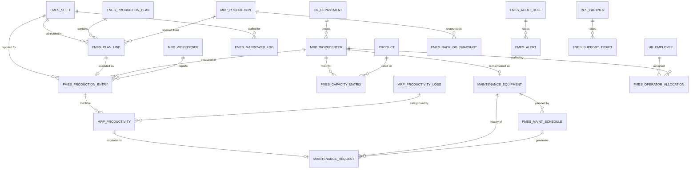

# 03 — Data Model

All new models use the `fmes.` prefix. Odoo models we extend are listed with only
the fields `furnishing_mes` adds.

Conventions applied to every operational model:

- `company_id` — `res.company`, required, default `env.company` (multi-company safe)
- `active` — on master data only, for archiving instead of deleting
- `_inherit = ['mail.thread', 'mail.activity.mixin']` on models with a workflow
- `tracking=True` on state and quantity fields, for the audit trail
- `_check_company_auto = True` where cross-company leakage is possible

---

## 1. Entity Relationship Overview

---

## 2. Master Data

### 2.1 `fmes.shift` — Shift Master *(new, Phase 2)*

Requirements 1.6, 2.5.

| Field | Type | Notes |
|---|---|---|
| `name` | Char | "Shift A", required |
| `code` | Char | "A", required, unique per company |
| `sequence` | Integer | Display order |
| `start_time` | Float | 6.0 = 06:00 |
| `end_time` | Float | 14.0 = 14:00 |
| `duration_hours` | Float | computed, stored; handles overnight wrap |
| `break_minutes` | Integer | Deducted from available capacity |
| `net_hours` | Float | computed = `duration_hours - break_minutes/60` |
| `resource_calendar_id` | M2O `resource.calendar` | Optional, for finite-capacity scheduling |
| `company_id`, `active` | | |

`_sql_constraints`: unique `(code, company_id)`.

### 2.2 `mrp.workcenter` extension — Machine Master *(Phase 2)*

Requirements 3.1, 3.2, 5.x, 7.1.

| Field | Type | Notes |
|---|---|---|
| `fmes_machine_code` | Char | Customer's own machine code; indexed |
| `department_id` | M2O `hr.department` | Department-wise monitoring |
| `equipment_id` | M2O `maintenance.equipment` | **The bridge Enterprise's `mrp_maintenance` would provide** |
| `fmes_std_manpower` | Float | Standard operators required |
| `fmes_is_bottleneck` | Boolean | Manually flagged or auto-detected |
| `fmes_criticality` | Selection | `low` / `medium` / `high` / `critical` |
| `fmes_capacity_ids` | O2M `fmes.capacity.matrix` | |
| `fmes_utilization_pct` | Float | computed, last 30 days |
| `fmes_current_state` | Selection | computed: `idle` / `running` / `blocked` / `maintenance` |

Native fields we rely on and do **not** duplicate: `oee`, `oee_target`,
`time_efficiency`, `default_capacity`, `resource_calendar_id`, `costs_hour`.

### 2.3 `maintenance.equipment` extension *(Phase 2/7)*

| Field | Type | Notes |
|---|---|---|
| `workcenter_id` | M2O `mrp.workcenter` | Inverse of the bridge |
| `fmes_schedule_ids` | O2M `fmes.maintenance.schedule` | |
| `fmes_health_score` | Float | computed 0–100, from MTBF, overdue PMs, recent downtime |
| `fmes_criticality` | Selection | Drives alert severity |

Native and reused: `effective_date`, `expected_mtbf`, `mtbf`, `mttr`,
`latest_failure_date`, `estimated_next_failure`, `maintenance_ids`.

### 2.4 `fmes.capacity.matrix` — Machine Capacity Matrix *(new, Phase 2)*

The heart of Requirement 1.2. One row = "what this machine can do with this item".

| Field | Type | Notes |
|---|---|---|
| `workcenter_id` | M2O `mrp.workcenter` | required |
| `product_id` | M2O `product.product` | optional |
| `product_category_id` | M2O `product.category` | optional; fallback when no product row exists |
| `std_output_qty` | Float | required, standard output |
| `std_output_uom_id` | M2O `uom.uom` | |
| `time_basis` | Selection | `per_hour` / `per_shift` / `per_day` |
| `std_output_per_hour` | Float | computed, normalised — the value the engine actually uses |
| `std_manpower` | Float | Operators needed for this combination |
| `changeover_minutes` | Integer | Setup time when switching to this product |
| `efficiency_factor` | Float | default 1.0; derating for older machines |
| `date_from`, `date_to` | Date | Time-bounded rates |
| `priority` | Integer | Preferred machine when several can run an item |
| `company_id`, `active` | | |

Resolution order used by the planning engine:
**exact product row → product category row (walking up the category tree) → no rate.**

A missing rate resolves to `0.0`, not to `workcenter.default_capacity`. That
field means "pieces produced in parallel", not an hourly rate, so substituting
it would yield plausible-looking plans built on an unrelated number. A machine
with no defined rate is skipped by the planner and shown as such.

`_sql_constraints`: `std_output_qty > 0`; no overlapping validity window for the
same `(workcenter_id, product_id)`.

### 2.5 `mrp.workcenter.productivity.loss` extension — Downtime Reasons *(Phase 5)*

| Field | Type | Notes |
|---|---|---|
| `fmes_category` | Selection | `maintenance`, `power_failure`, `material_shortage`, `material_handling`, `operator_absence`, `manpower_rescheduling`, `operator_inefficiency`, `unscheduled_stoppage`, `changeover`, `other` |
| `fmes_is_planned` | Boolean | Planned stoppages excluded from availability loss |
| `fmes_requires_maintenance` | Boolean | Auto-raise a maintenance request when logged |
| `fmes_alert_threshold_hours` | Float | Feeds the `excess_downtime` alert rule |

Native `loss_type` (`availability` / `performance` / `quality` / `productive`) is
kept, because `_compute_oee` depends on it.

---

## 3. Planning

### 3.1 `fmes.production.plan` *(new, Phase 3)*

| Field | Type | Notes |
|---|---|---|
| `name` | Char | From `ir.sequence` `fmes.production.plan` |
| `plan_type` | Selection | `daily` / `weekly` / `monthly` |
| `date_from`, `date_to` | Date | required |
| `department_ids` | M2M `hr.department` | Scope |
| `state` | Selection | `draft` → `confirmed` → `released` → `in_progress` → `done` / `cancelled` |
| `line_ids` | O2M `fmes.production.plan.line` | |
| `generated_by` | Selection | `auto` / `manual` |
| `total_planned_qty`, `total_planned_hours` | Float | computed |
| `capacity_utilization_pct` | Float | computed: planned load over available capacity |
| `company_id` | | |

Inherits `mail.thread`, `mail.activity.mixin`.

### 3.2 `fmes.production.plan.line` *(new, Phase 3)*

| Field | Type | Notes |
|---|---|---|
| `plan_id` | M2O, ondelete cascade | |
| `date` | Date | required, indexed |
| `shift_id` | M2O `fmes.shift` | required |
| `workcenter_id` | M2O `mrp.workcenter` | required, indexed |
| `department_id` | related, stored | For grouping |
| `product_id` | M2O `product.product` | required |
| `production_id` | M2O `mrp.production` | Source manufacturing order |
| `workorder_id` | M2O `mrp.workorder` | |
| `planned_qty` | Float | required |
| `planned_hours` | Float | computed from the capacity matrix |
| `planned_manpower` | Float | |
| `sequence` | Integer | Order within the shift |
| `source` | Selection | `auto` / `manual` / `carry_forward` |
| `carry_forward_from_id` | M2O self | Traceability of rolled-over quantity |
| `priority` | Selection | `0` normal / `1` urgent |
| `date_deadline` | Date | related from `production_id` |
| `state` | Selection | `pending` / `in_progress` / `done` / `partial` / `cancelled` |
| `entry_id` | M2O `fmes.production.entry` | Actual execution |

Index on `(date, workcenter_id, shift_id)`.

---

## 4. Execution and Daily Tracking

### 4.1 `fmes.production.entry` *(new, Phase 4)*

The single daily production record. Serves Requirement 2 end to end and feeds
every analytic.

| Field | Type | Notes |
|---|---|---|
| `name` | Char | Sequence `fmes.production.entry` |
| `date` | Date | required, indexed |
| `shift_id` | M2O `fmes.shift` | required, indexed |
| `workcenter_id` | M2O `mrp.workcenter` | required, indexed |
| `department_id` | related, stored | |
| `product_id` | M2O `product.product` | required |
| `plan_line_id` | M2O `fmes.production.plan.line` | Link to plan |
| `production_id` | M2O `mrp.production` | |
| `workorder_id` | M2O `mrp.workorder` | |
| `planned_qty` | Float | Target — defaults from `plan_line_id` |
| `actual_qty` | Float | Produced, tracked |
| `rejected_qty` | Float | |
| `ok_qty` | Float | computed = `actual_qty - rejected_qty` |
| `variance_qty` | Float | computed = `actual_qty - planned_qty` |
| `achievement_pct` | Float | computed = `actual_qty / planned_qty * 100` |
| `run_hours` | Float | Productive time |
| `downtime_hours` | Float | computed, sum of linked productivity logs |
| `available_hours` | Float | computed from `shift.net_hours` |
| `utilization_pct` | Float | computed = `run_hours / available_hours * 100` |
| `std_output_qty` | Float | computed from the capacity matrix, for efficiency |
| `efficiency_pct` | Float | computed = `actual_qty / std_output_qty * 100` |
| `std_manpower`, `actual_manpower` | Float | |
| `operator_ids` | M2M `hr.employee` | |
| `productivity_ids` | O2M `mrp.workcenter.productivity` | Downtime events |
| `state` | Selection | `draft` → `submitted` → `approved` / `rejected` |
| `submitted_by`, `approved_by` | M2O `res.users` | |
| `import_batch_id` | M2O `fmes.import.batch` | Provenance for XLSX rows |
| `company_id` | | |

**Invariants**
- Unique on `(date, shift_id, workcenter_id, product_id, company_id)` — one row
  per machine per product per shift per day.
- `actual_qty >= 0`, `rejected_qty <= actual_qty`.
- Records in `approved` state are read-only for everyone except Plant Manager
  (enforced in `write()`), giving Requirement 3.4 its immutable history.

### 4.2 `mrp.workcenter.productivity` extension *(Phase 5)*

| Field | Type | Notes |
|---|---|---|
| `fmes_entry_id` | M2O `fmes.production.entry` | |
| `fmes_shift_id` | M2O `fmes.shift` | |
| `fmes_category` | related from `loss_id.fmes_category`, stored | For fast grouping |
| `fmes_remarks` | Text | Operator's free-text note |
| `fmes_reported_by` | M2O `res.users` | |
| `fmes_state` | Selection | `draft` → `approved` / `rejected` (supervisor approval) |
| `fmes_approved_by` | M2O `res.users` | |
| `fmes_maintenance_request_id` | M2O `maintenance.request` | Escalation link |

Native `duration` (minutes), `date_start`, `date_end`, `loss_id`, `workcenter_id`
are reused unchanged.

---

## 5. Manpower

### 5.1 `fmes.manpower.log` *(new, Phase 8)*

| Field | Type | Notes |
|---|---|---|
| `date`, `shift_id` | | required, indexed |
| `workcenter_id` | M2O | optional (department-level logging allowed) |
| `department_id` | M2O `hr.department` | required |
| `std_manpower` | Float | Standard requirement |
| `actual_manpower` | Float | Present |
| `absent_count` | Integer | |
| `shortage` | Float | computed = `std - actual`, stored |
| `shortage_pct` | Float | computed |
| `utilization_pct` | Float | computed = `actual / std * 100` |
| `overtime_hours` | Float | |
| `reason` | Text | |
| `company_id` | | |

### 5.2 `fmes.operator.allocation` *(new, Phase 8)*

| Field | Type | Notes |
|---|---|---|
| `date`, `shift_id` | | required |
| `employee_id` | M2O `hr.employee` | required |
| `workcenter_id` | M2O `mrp.workcenter` | required |
| `role` | Selection | `operator` / `helper` / `setter` / `inspector` |
| `state` | Selection | `planned` / `present` / `absent` / `reassigned` |
| `hours` | Float | |

Unique on `(date, shift_id, employee_id)` — one operator, one place, one shift.
This model also drives the operator record rule: an Operator only sees the work
centers they are allocated to today.

---

## 6. Backlog

### 6.1 `fmes.backlog.snapshot` *(new, Phase 9)*

Written by a nightly cron; never edited by hand. Historical rows are what make
backlog *trends* possible.

| Field | Type | Notes |
|---|---|---|
| `snapshot_date` | Date | required, indexed |
| `production_id` | M2O `mrp.production` | |
| `sale_order_id` | M2O `sale.order` | Mock ERP order |
| `partner_id` | M2O `res.partner` | Customer |
| `product_id` | M2O `product.product` | |
| `department_id`, `workcenter_id` | M2O | |
| `ordered_qty`, `produced_qty` | Float | |
| `pending_qty` | Float | computed, stored |
| `completion_pct` | Float | computed |
| `date_deadline` | Date | |
| `days_delayed` | Integer | computed vs `snapshot_date` |
| `status` | Selection | `pending` / `blocked` / `delayed` / `at_risk` / `completed` |
| `block_reason` | Selection | `material` / `machine` / `manpower` / `quality` / `customer_hold` / `other` |
| `block_note` | Text | |
| `is_critical` | Boolean | computed from `days_delayed` and value |

Unique on `(snapshot_date, production_id)`.

---

## 7. Maintenance

### 7.1 `fmes.maintenance.schedule` *(new, Phase 7)*

Preventive maintenance plans. A cron converts due schedules into native
`maintenance.request` records, so all history stays in one place.

| Field | Type | Notes |
|---|---|---|
| `name` | Char | required |
| `equipment_id` | M2O `maintenance.equipment` | required |
| `workcenter_id` | related, stored | |
| `maintenance_team_id` | M2O `maintenance.team` | |
| `trigger_type` | Selection | `time_based` / `usage_based` |
| `interval_number`, `interval_unit` | Integer / Selection | `day` / `week` / `month` / `year` |
| `usage_threshold_hours` | Float | For `usage_based` |
| `last_done_date` | Date | |
| `next_due_date` | Date | computed, stored, indexed |
| `lead_time_days` | Integer | How early to raise the request |
| `estimated_duration_hours` | Float | |
| `checklist_ids` | O2M `fmes.maintenance.checklist.line` | |
| `request_ids` | O2M `maintenance.request` | Generated history |
| `state` | Selection | `active` / `paused` / `archived` |

### 7.2 `fmes.maintenance.checklist.line` *(new, Phase 7)*

`schedule_id`, `sequence`, `name`, `is_mandatory`, `expected_value`.

### 7.3 `maintenance.request` extension *(Phase 7)*

| Field | Type | Notes |
|---|---|---|
| `workcenter_id` | M2O `mrp.workcenter` | |
| `fmes_schedule_id` | M2O `fmes.maintenance.schedule` | Origin, if preventive |
| `fmes_downtime_hours` | Float | Production time lost |
| `fmes_productivity_id` | M2O `mrp.workcenter.productivity` | Downtime event that triggered it |
| `fmes_cost` | Monetary | Parts + labour |
| `fmes_checklist_result_ids` | O2M | Filled checklist |

---

## 8. Alerts

### 8.1 `fmes.alert.rule` *(new, Phase 11)*

| Field | Type | Notes |
|---|---|---|
| `name` | Char | required |
| `alert_type` | Selection | The seven types from Requirement 10 |
| `scope` | Selection | `global` / `department` / `workcenter` |
| `department_ids`, `workcenter_ids` | M2M | Scope filter |
| `operator` | Selection | `gt` / `gte` / `lt` / `lte` / `eq` |
| `threshold` | Float | |
| `threshold_uom` | Selection | `percent` / `hours` / `qty` / `days` |
| `severity` | Selection | `info` / `warning` / `critical` |
| `recipient_group_ids` | M2M `res.groups` | |
| `recipient_user_ids` | M2M `res.users` | |
| `notify_activity`, `notify_email`, `notify_discuss` | Boolean | Channels |
| `mail_template_id` | M2O `mail.template` | |
| `cooldown_minutes` | Integer | Suppresses alert storms |
| `active` | Boolean | |

### 8.2 `fmes.alert` *(new, Phase 11)*

`rule_id`, `triggered_on` (Datetime), `severity`, `subject`, `body`,
`res_model` + `res_id` (the record that tripped it), `measured_value`,
`threshold_value`, `state` (`new` / `acknowledged` / `resolved` / `dismissed`),
`acknowledged_by`, `acknowledged_on`, `resolution_note`.

---

## 9. Customer Portal

### 9.1 `fmes.support.ticket` *(new, Phase 13)*

Helpdesk is Enterprise-only, so a lightweight ticket model is provided.

`name` (sequence), `partner_id`, `subject`, `description`, `category`
(`order_status` / `quality` / `delivery` / `billing` / `other`), `priority`,
`state` (`new` / `in_progress` / `waiting_customer` / `resolved` / `closed`),
`assigned_to`, `sale_order_id`, `production_id`, `resolution`, `closed_on`.
Inherits `mail.thread` + `portal.mixin` so customers can follow and reply.

---

## 10. Integration Seam *(stubbed Phase 1, built post-project)*

### 10.1 `fmes.erp.sync.mixin` — AbstractModel

Mixed into `mrp.production`, `product.template`, `mrp.bom`, `res.partner`,
`sale.order`:

| Field | Type | Notes |
|---|---|---|
| `erp_external_id` | Char | Indexed, the ERP 10.8 primary key |
| `erp_source_system` | Char | default `erp_10_8` |
| `erp_last_sync` | Datetime | |
| `erp_sync_state` | Selection | `not_synced` / `synced` / `pending` / `error` |
| `erp_sync_message` | Text | Last error |

### 10.2 `fmes.sync.log`

`direction` (`inbound` / `outbound`), `entity`, `record_count`, `success_count`,
`error_count`, `started_on`, `finished_on`, `state`, `payload_ref`, `message`.

Full design: [`09-erp-integration-roadmap.md`](09-erp-integration-roadmap.md).

---

## 11. Read Models (SQL Views, `_auto = False`)

Each is a PostgreSQL view exposed as an Odoo model for pivot and graph views.

| Model | Grain | Key measures |
|---|---|---|
| `fmes.production.report` | date × shift × workcenter × product | planned, actual, rejected, achievement %, efficiency % |
| `fmes.downtime.report` | date × shift × workcenter × loss category | downtime hours, event count, % of available time |
| `fmes.utilization.report` | date × shift × workcenter | available / run / down hours, utilisation %, OEE inputs |
| `fmes.maintenance.report` | month × equipment | request count, PM vs breakdown, MTBF, MTTR, downtime hours, cost |

Materialised views are **not** used initially. If dashboard latency exceeds the
2 s target, `fmes.production.report` is promoted to a materialised view refreshed
by cron — noted as a Phase 14 performance option.

---

## 12. Sequences (`ir.sequence`)

| Code | Format |
|---|---|
| `fmes.production.plan` | `PLAN/%(year)s/00000` |
| `fmes.production.entry` | `PE/%(year)s%(month)s/00000` |
| `fmes.maintenance.schedule` | `PM/%(year)s/0000` |
| `fmes.support.ticket` | `TKT/%(year)s/00000` |
| `fmes.import.batch` | `IMP/%(year)s%(month)s%(day)s/000` |

## 13. Indexing Plan

| Table | Index |
|---|---|
| `fmes_production_entry` | `(date, workcenter_id, shift_id)`, `(state)`, `(product_id)` |
| `fmes_production_plan_line` | `(date, workcenter_id, shift_id)`, `(state, source)` |
| `mrp_workcenter_productivity` | `(fmes_shift_id)`, `(fmes_category)` — added by us |
| `fmes_backlog_snapshot` | `(snapshot_date, status)`, `(production_id)` |
| `fmes_capacity_matrix` | `(workcenter_id, product_id, date_from, date_to)` |
| `fmes_alert` | `(state, severity, triggered_on)` |
